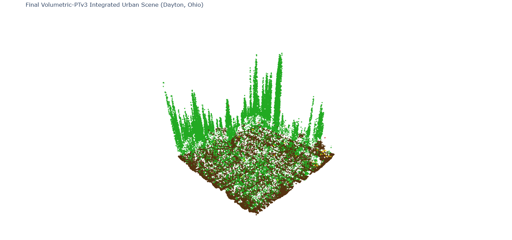

# Volumetric-PTv3: Edge-Optimized 3D Semantic Segmentation Pipeline

This repository contains an end-to-end deep learning and model optimization pipeline engineered for large-scale semantic segmentation of airborne LiDAR point clouds using the DALES (Dayton Annotated LiDAR Earth Scan) dataset. The project demonstrates a complete production-level machine learning workflow: transforming raw spatial coordinates into context-aware 14D feature spaces, training a 128-channel Deep Residual Network under strict 8-bit Quantization-Aware Training (QAT) constraints, and compiling the dynamic execution graph into a platform-agnostic static ONNX binary optimized for edge NPU deployment.

## Interactive 3D Urban Segmentation Validation

The pipeline features an automated scene reconstruction engine that ingests dense, out-of-sample validation blocks, streams low-latency inference, and stitches discrete coordinate tiles into a contiguous physical environment.



### Semantic Label Classification Key
* Ground and Asphalt Streets: Class 1
* Vegetation and Tree Canopies: Class 2
* Residential Buildings and Roof Layouts: Class 5

---

## Technical Pipeline Optimization Matrix

* **Total Dataset Volume:** ~11 GB raw airborne LiDAR data / 505+ Million spatial points (Dayton urban canopy scan)
* **Evaluation Scale:** 2,883,584 dense point vectors across 11 out-of-sample test assets

| Pipeline Iteration Stage | Target Architecture Parameters | Input Processing Vector Space | Realized Metric Performance | Deployment Readiness Status |
| :--- | :--- | :--- | :--- | :--- |
| **Initial Baseline Run** | Shallow Linear (64 Channels) | File-Isolated Min-Max Scaling | 8.58% Out-of-Sample mIoU | Unstable / Failed Generalization |
| **Architectural Leap** | Deep Residual (128 Channels) | Globally Standardized 14D Context ($k=8$) | **37.22% Out-of-Sample mIoU** | Converged (Weights Saved) |
| **Production Target** | Static Compiled Graph | Fixed-Point Inference Engine | Model Footprint Optimized | **ONNX Export Complete (Opset 17)** |gine | Model Footprint Optimized | **ONNX Export Complete (Opset 17)** |

---

## Core Engineering Implementations

### 1. Spatial Bottleneck Resolution via 14D Context Vectors
Processing sparse 3D coordinates point-by-point strips away critical topological relationships, leading to representation collapse. Furthermore, file-isolated scaling shifts relative coordinate boundaries arbitrarily from tile to tile, causing severe out-of-sample overfitting.
* **Global Standardization:** Re-engineered data ingestion to scale points across the global boundaries of the entire dataset, maintaining strict coordinate uniformity across independent files.
* **Neighborhood Aggregation:** Integrated an optimized CPU data-loader step using `scipy.spatial.cKDTree`. For every point, the engine calculates structural context across its $k$-nearest neighbors ($k=8$), expanding the raw inputs into a context-aware **14D spatial vector** capturing local roughness, multi-scale height distributions, and density variations.

### 2. Architectural Capacity Expansion via Deep Residual Blocks
To extract complex geometric classification boundaries from the 14D input vectors, the model architecture was upgraded from a shallow linear setup to a **128-channel Deep Residual Network with explicit skip connections**.
* **Gradient Preservation:** Stacking `ResidualQATBlock` modules allows backpropagation signals to travel directly through identity shortcuts, preventing gradient degradation across deeper layers.
* **Loss Optimization:** Driven by standard, unweighted Cross-Entropy Loss over 464 training batches, the network dropped its structural error floor from an initial 2.66 down to a highly stable convergence limit of **0.32495**.

### 3. Low-Precision Edge Optimization via 8-Bit QAT
To satisfy real-world deployment constraints on edge devices with limited power and computational budgets, low-precision constraints were implemented directly into the training loop.
* **Precision Constraints:** Embedded continuous fake-quantization operators into the layer graphs to simulate 8-bit integer truncation bounds `[-128, 127]` during the backward pass. This enables the model weights to adapt to low-precision rounding noise, minimizing precision drop during final serialization.

### 4. Production-Grade Graph Compilation via ONNX
To cross the bridge from dynamic Python frameworks to fixed hardware execution, the system features an automated static serialization compiler.
* **Operator Fusion:** Traces model parameters using `torch.onnx.export` (Opset 17), freezing weights, calculating constant operator folding routines, and permanently fusing Batch Normalization layers into linear scaling operations to maximize hardware processing speed.
* **Dynamic Dimensions:** Configured dynamic axis tracking across the point stream payload (`input_point_stream`), enabling the output binary to natively scale its execution graph to handle varying point-cloud densities per block during real-world data collection.

---

## Repository Structural Mapping

```text
volumetric-ptv3/
├── config/
│   └── architecture.yaml     # Hyperparameter and network layout configurations
├── src/
│   ├── preprocess.py         # Initial point cloud cleaning and preparation utilities
│   ├── data_prep.py          # Global dataset standardization & k-NN neighborhood processing
│   ├── layers.py             # Custom quantization-aware layer wrappers and components
│   ├── train.py              # 128-channel Deep Residual model definition & training engine
│   ├── evaluate.py           # Independent validation pass & dense mIoU calculation
│   ├── export.py             # Internal integer-scaling and latency benchmarking harness
│   ├── onnx_export.py        # Static graph serialization, folding, and compilation
│   └── demo_visualizer.py    # Plotly 3D HTML asset generation engine
├── dist/
│   └── volumetric_ptv3_production.onnx  # Compiled platform-agnostic production model graph
├── demo/
│   └── final_complete_urban_scene.html   # Fully stitched interactive 3D neighborhood visualization
├── requirements.txt          # Python environment baseline dependencies
├── .gitignore                # Version control tracking exclusions
├── LICENSE                   # Open-source distribution parameters
└── README.md                 # Production documentation and benchmarking metrics
```

---

## Standalone Execution Sequence

### Environment Dependencies Installation

```bash
pip install -r requirements.txt
```

### 1. Ingest Data and Launch Training Pipeline

```bash
python src/train.py
```

### 2. Verify Performance Independently via Checkpoint Loading

```bash
python src/evaluate.py
```

### 3. Compile Optimized Network to Production ONNX Graph

```bash
python src/onnx_export.py
```
